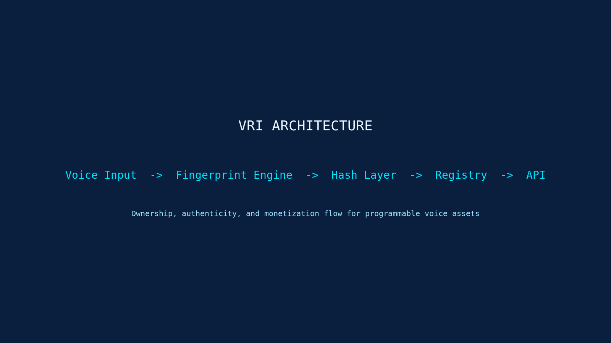
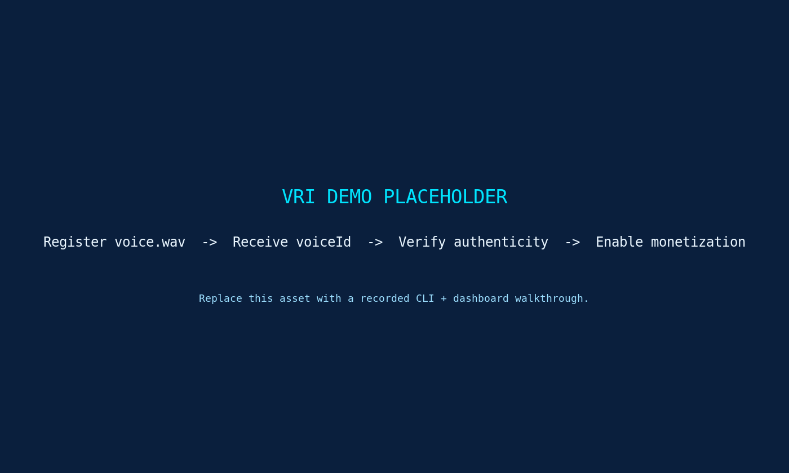

<p align="center">
  
</p>

<p align="center">
  
  
  
</p>

<h1 align="center">VRI · Voice Rights Infrastructure</h1>
<p align="center"><strong>Own. Verify. Monetize voice.</strong></p>
<p align="center">A premium, crypto-inspired protocol layer for registering voice ownership, generating fingerprints, verifying authenticity, and unlocking monetization for AI-native voice assets.</p>

## Tagline

> Own the signal. Verify the source. Monetize the voice.

## What Is VRI

VRI is an enterprise-grade protocol for voice provenance. It gives developers and platforms a clean path from raw voice input to fingerprint generation, cryptographic hashing, registry-backed ownership, verification, and monetization. The result is a system that feels native to AI, media, and Web3 workflows without forcing unnecessary complexity into the product surface.

**Elevator pitch:** VRI turns voice into a verifiable digital asset. By combining fingerprinting, deterministic hashing, registry records, and programmable verification, it helps builders prove who owns a voice, confirm whether an audio artifact is authentic, and connect usage to monetization rails.

## How It Works

```text
Voice -> Fingerprint -> Hash -> Register -> Verify -> Monetize
```

1. `Voice Input`
   Capture a source recording or generated artifact.
2. `Fingerprint`
   Extract a stable representation of the voice signal.
3. `Hash`
   Produce a deterministic cryptographic digest.
4. `Register`
   Store ownership metadata and proof references in a registry layer.
5. `Verify`
   Validate that a voice asset matches its registered identity.
6. `Monetize`
   Connect verified usage to licensing, payments, or access rules.

## Architecture

<p align="center">
  
</p>

```text
┌──────────────┐    ┌────────────────────┐    ┌──────────────┐    ┌───────────────┐    ┌──────────────┐
│ Voice Input  │ -> │ Fingerprint Engine │ -> │  Hash Layer  │ -> │    Registry   │ -> │  API / SDK   │
└──────────────┘    └────────────────────┘    └──────────────┘    └───────────────┘    └──────────────┘
        |                      |                        |                     |                    |
        |                      |                        |                     |                    |
        v                      v                        v                     v                    v
  WAV / MP3 / PCM       Signal features          SHA-256 digest      Ownership record      Verify / monetize
```

Core repository references:

- [VRI-PROTOCOL-v1.0.md](./VRI-PROTOCOL-v1.0.md)
- [WHITEPAPER.md](./WHITEPAPER.md)
- [docs/architecture.md](./docs/architecture.md)
- [docs/verification.md](./docs/verification.md)

## Demo

<p align="center">
  
</p>

`demo.gif` should show:

1. A developer registering `voice.wav` from the CLI.
2. The SDK returning a `voiceId`, fingerprint, and hash.
3. A verification request confirming authenticity.
4. A dashboard card indicating the asset is now ready for licensing or royalties.

## Getting Started

```bash
npm install
```

Register a voice from the CLI:

```bash
node ./src/index.js register ./examples/test/audio.wav
```

Expected response:

```json
{
  "voiceId": "vri_6d2f09e71c5e6c93",
  "status": "registered"
}
```

Verify a registered voice:

```bash
node ./src/index.js verify vri_6d2f09e71c5e6c93
```

Use the SDK directly:

```js
import { registerVoice, verifyVoice } from "./src/sdk.js";

const registration = await registerVoice("./examples/test/audio.wav");
const verification = await verifyVoice(registration.voiceId);

console.log(registration);
console.log(verification);
```

## API Overview

### `registerVoice(file)`

Registers a voice asset from a local file path, `Buffer`, or `Uint8Array` and returns:

```json
{
  "voiceId": "vri_6d2f09e71c5e6c93",
  "status": "registered",
  "fingerprint": "fp_4f9f8cf4a8103d0a7f4d7ec5",
  "audioHash": "6d2f09e71c5e6c93b7a62b7a8f2e9d5f...",
  "registry": "vri:testnet"
}
```

### `verifyVoice(id)`

Verifies the format and simulated registry status of a VRI voice identifier:

```json
{
  "voiceId": "vri_6d2f09e71c5e6c93",
  "status": "verified",
  "authenticity": "confirmed",
  "registry": "vri:testnet"
}
```

### CLI

```bash
vri register voice.wav
```

Returns:

```json
{
  "voiceId": "vri_xxx",
  "status": "registered"
}
```

## Example SDK

The repository includes a minimal ESM SDK in [src/sdk.js](./src/sdk.js) and a small CLI in [src/index.js](./src/index.js). The implementation is intentionally compact, readable, and ready to extend into a service-backed registry client.

## Use Cases

- AI companies registering synthetic voices before commercial deployment.
- Media companies verifying talent-approved voice assets in publishing pipelines.
- Marketplaces enabling licensing and royalty distribution for voice IP.
- Web3 builders anchoring voice proofs to wallets, attestations, or onchain registries.
- Enterprise platforms creating compliance-grade provenance around voice interactions.

## Repository Structure

```text
assets/
  banner.png
  architecture.png
  demo.gif
  logo.png
  logo-readme.png
src/
  index.js
  sdk.js
docs/
  architecture.md
  verification.md
  system-overview.md
README.md
package.json
```

## Roadmap

- [x] Publish protocol and whitepaper foundation.
- [x] Add branded repository assets and SDK examples.
- [ ] Introduce remote registry integration.
- [ ] Add signed proof-package generation and verification endpoints.
- [ ] Ship reference dashboards for licensing and monetization flows.
- [ ] Expand to wallet-bound claims and programmable access control.

## Vision

Voice is becoming a programmable interface, a commercial asset, and a new category of identity. VRI is designed to become the trust layer beneath that shift: a protocol that lets builders prove ownership, confirm origin, and route value with confidence across AI, media, and crypto-native ecosystems.

## Existing Protocol Material

This repository already contains the deeper protocol specification and companion documents:

- [VRI-PROTOCOL-v1.0.md](./VRI-PROTOCOL-v1.0.md)
- [WHITEPAPER.md](./WHITEPAPER.md)
- [DOCUMENTATION.md](./DOCUMENTATION.md)
- [docs/system-overview.md](./docs/system-overview.md)
- [docs/crypto-spec.md](./docs/crypto-spec.md)
- [docs/watermark-spec.md](./docs/watermark-spec.md)

## License

Apache 2.0
