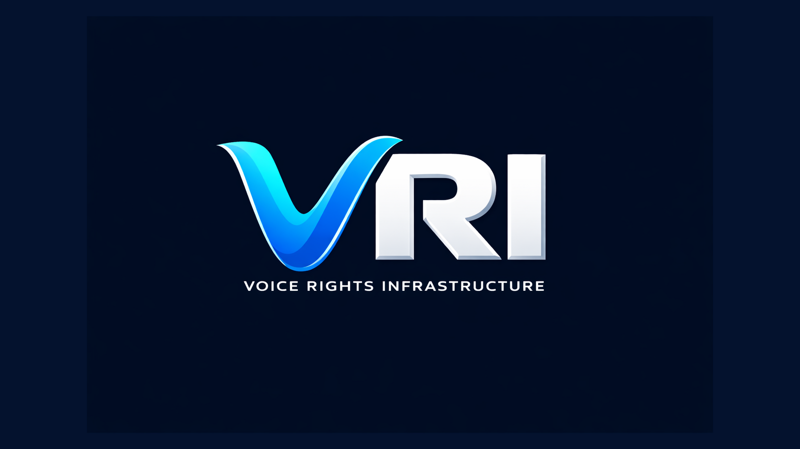

<p align="center">
  
</p>

<p align="center">
  
  
  
</p>
<meta property="og:type" content="website">
<meta property="og:url" content="https://github.com/tu-usuario/vri">
<meta property="og:title" content="VRI · Voice Rights Infrastructure">
<meta property="og:description" content="System-level standard for verifiable recorded and generated audio provenance.">
<meta property="og:image" content="https://raw.githubusercontent.com/tu-usuario/vri/main/assets/banner.png">

<meta property="twitter:card" content="summary_large_image">
<meta property="twitter:title" content="VRI · Voice Rights Infrastructure">
<meta property="twitter:image" content="https://raw.githubusercontent.com/tu-usuario/vri/main/assets/banner.png">

# VRI · Voice Rights Infrastructure

System-level standard for verifiable recorded and generated audio provenance.

VRI does not detect audio. It verifies cryptographic proof attached to it.

## Quick Navigation

- [1) What VRI Actually Is](#1-what-vri-actually-is)
- [2) Current Project Status](#2-current-project-status)
- [3) The Problem](#3-the-problem)
- [4) The Solution](#4-the-solution)
- [5) How It Works (Real Flow)](#5-how-it-works-real-flow)
- [6) Core Concepts](#6-core-concepts)
- [7) Verification Model](#7-verification-model)
- [8) Security and Formal Assurance](#8-security-and-formal-assurance)
- [9) Architecture](#9-architecture)
- [10) What This Repo Contains](#10-what-this-repo-contains)
- [11) What Is Not Included](#11-what-is-not-included)
- [12) Demo (Input -> Audio -> Proof -> Verify VALID)](#12-demo-input---audio---proof---verify-valid)
- [13) Roadmap](#13-roadmap)
- [14) Additional Docs](#14-additional-docs)

## 1) What VRI Actually Is

VRI v2.0 is a system-level standard for generating and verifying cryptographic provenance proofs for both recorded and generated audio.

At its core, VRI defines a reproducible proof path with explicit mode separation:

- deterministic audio hash
- `proof_type`: `RECORDED` or `GENERATED`
- watermark payload for `GENERATED` proofs at `compliance_level >= 2`
- Ed25519 signature
- proof package JSON
- optional QR/Secure-Enclave identity binding
- optional audited time attestation and ledger evidence at Level 3

The Node.js code in this repository is a reference verifier and protocol implementation. It is not an audio generation engine.
It is also not a downstream business-logic or analytics layer.

## 2) Current Project Status

VRI is now best understood as an emerging system-level standard for audio provenance rather than as a narrow cryptographic sketch.

Current project posture:

- Protocol semantics: strong. `proof_type`, `compliance_level`, trust mapping, fail-closed verification, and lineage behavior are now defined much more explicitly than in earlier drafts.
- Reference implementation: strong for validation and pilot deployments. The Node packages and API cover canonicalization, proof issuance and verification, identity-bound sessions, ledger evidence, and Level 3 timestamp-attestation workflows.
- Operational production posture: partial. The repo includes reference persistence, trust-policy loading, and TSA integration hooks, but production multi-instance storage, external PKI governance, and deployment blueprints remain environment-specific work.
- Legal/evidentiary posture: improved but bounded. VRI can produce much stronger technical evidence than unsigned media pipelines, but legal personhood, identity proofing, and court admissibility still depend on external governance and operating practice.

What is effectively implemented today:

- explicit `RECORDED` and `GENERATED` proof separation
- Level 1/2/3 compliance semantics with strict watermark enforcement for `GENERATED` proofs at `compliance_level >= 2`
- QR/Secure-Enclave identity layer with session scope, expiry, single-use enforcement, and proof binding
- export lineage enforcement and parent-event validation
- revocation status reporting and conservative historical-validity handling
- normalized RFC 3161 timestamp-attestation verification, raw token ingestion, and an optional built-in `openssl` adapter
- named/versioned TSA trust profiles and release artifacts for auditability
- **session-based, identity-linked, AI-traceable verification model** (see below): every generated audio is now traceable to an actor identity (`actor_id`), a recording context (`RecordingSession`), and an AI model (`InferenceMetadata.model_id`)
- pre-inference session gate: `requireVerifiedSession` enforces QR-verified sessions before any GENERATED proof is accepted
- pre-inference input gate: `requireInputVerification` enforces that the source audio was recorded and registered within this system before being used as model input

The biggest remaining gap is not basic protocol coherence. It is the final production-grade integration layer around PKI/TSA operations, shared state, and external governance.

## 3) The Problem

Current audio pipelines often cannot answer basic trust questions deterministically:

- Who generated this audio?
- Was the generation authorized?
- Can a third party verify the claim without trusting the generator?

Without deterministic verification, provenance claims become policy statements instead of technical guarantees.

## 4) The Solution

VRI defines a proof package that can be verified independently.

Verification uses public data (audio + proof package + public key material) and deterministic checks. No hidden server state is required for the core cryptographic validation path.

VRI does not detect audio. It verifies cryptographic proof attached to it.

## 5) How It Works (Real Flow)

### Legacy flow (still supported)

```text
Capture or Generation Boundary
  -> Canonicalization
  -> Mode-specific binding (watermark when required)
  -> Signature over signed proof semantics
  -> Optional time attestation and ledger registration
  -> External Verification
```

### Session-based flow (current recommended model)

```text
Recording Context
  -> Actor activates RecordingSession via QR scan (session_verified = true)
  -> Studio records source audio
  -> Source audio registered as RECORDED proof in the ledger

Inference Boundary
  -> Pre-inference gate 1: session MUST be QR-verified
  -> Pre-inference gate 2: input_reference MUST point to a RECORDED ledger event
  -> Model generates audio
  -> InferenceMetadata captured: model_id, model_provider, input_reference, input_verified

Proof Generation
  -> Canonicalization
  -> Watermark injection (GENERATED, compliance >= 2)
  -> Signature over: audio hash + session_id + actor_id + inference_metadata + metadata
  -> Ledger registration

Traceability Output
  -> { audio, proof_package, session_id, inference_metadata }
  -> Proof cryptographically attests: WHO (actor_id), WHERE/WHEN (session_id), WHICH MODEL (model_id)
```

Important boundary:

- watermark injection happens during generation (inference runtime)
- verification can happen later, offline, by independent parties
- `session_id`, `actor_id`, and `inference_metadata` are INSIDE the signed proof — they cannot be altered post-signing
- this repository provides reference verification and protocol tooling

## 6) Core Concepts

### Audio Hash

SHA-256 over canonical PCM bytes. Canonicalization is deterministic so equivalent inputs produce the same digest under the same rules.

### Proof Type

Signed mode declaration that prevents downgrade ambiguity between `RECORDED` and `GENERATED`.

### Watermark Payload

Fixed-length embedded payload used only when the selected compliance profile requires a signal-bound claim.

### Signature

Ed25519 signature over the protocol message digest derived from canonical metadata, hash, watermark payload, and timestamp fields.

### Proof Package

Canonical JSON document containing verification material (hash, signature, metadata, key references, and protocol fields).

### RecordingSession _(new)_

A `RecordingSession` is the entity that links every generated audio artifact to a real-world recording context:

```jsonc
{
  "session_id": "rsess_...",
  "actor_id": "wallet_...",       // voice actor identity
  "studio_id": "studio_nyc_01",   // optional studio context
  "start_time": "2026-04-04T...", // when the session began
  "verification_method": "qr_scan" | "manual",
  "session_verified": true         // true only for QR-activated sessions
}
```

Sessions are created before inference begins. When `requireVerifiedSession` is enabled the server rejects any GENERATED registration that does not reference a QR-verified session.

### InferenceMetadata _(new)_

Captures the AI provenance of a generated audio artifact:

```jsonc
{
  "model_id": "tts-v3",            // REQUIRED — which AI model was used
  "model_provider": "openai",      // optional
  "input_reference": "evt_...",    // event ID of the source RECORDED audio
  "input_verified": true,          // true when input_reference passed system check
  "input_audio_hash": "0x..."      // hash of the source audio (set by server)
}
```

`InferenceMetadata` is included inside the signed `canonical_metadata`, making the AI model identity tamper-evident. When `requireInputVerification` is enabled, `input_reference` must point to a `RECORDED` ledger event — audio that did not originate within this system is rejected.

## 7) Verification Model

Verification is deterministic and reproducible:

- parse proof package fields
- recompute canonical audio hash
- recompute message digest (including session and inference context)
- verify Ed25519 signature

Core cryptographic verification works offline.
Level 1 yields a cryptographically valid but partial provenance result.
The current reference implementation fully supports Level 1 and Level 2, and can issue and verify Level 3 when independent timestamp attestation and deterministic ledger anchoring are supplied.
Level 3 additionally requires independent timestamp attestation plus ledger-backed ordering.

In the session-based model, a verified proof additionally attests:

- **Actor identity**: `actor_id` and `session_id` are inside the signed metadata, proving which wallet/identity authorized the generation
- **Recording context**: the `RecordingSession` provides studio context and QR-verified actor presence
- **AI traceability**: `inference_metadata.model_id` is signed into the proof, making the model identity tamper-evident
- **Source audio provenance**: when `input_verified = true`, the source audio used by the model was itself a system-registered `RECORDED` artifact

VRI does not detect audio. It verifies cryptographic proof attached to it.

## 8) Security and Formal Assurance

### 7.1 Verification Security Hardening (Implemented)

The reference verifier is now fail-closed for critical proof fields.

- `protocol_version` is required and validated (`2.0` in the strict path).
- `proof_type` is required and signed.
- `identity` can be required in strict identity profiles and is bound into the proof signature when present.
- `creator_id` is re-derived from `public_key` and enforced.
- `canonical_metadata` must match `metadata` when both are present.
- Conflicting watermark fields (`watermark_hex` vs `watermark_payload`) are rejected.
- Level 1 proofs are rejected if they carry watermark or ledger-attestation fields.

`/verify-proof` also returns structured trust signals:

- `cryptographic_valid`
- `watermark`: `present` | `missing` | `degraded` | `not_applicable`
- `identity_valid`
- `metadata_consistent`
- `protocol_valid`
- `trust_level`: `HIGH` | `PARTIAL` | `LOW`

Operational hardening included in the API and anchoring boundary:

- Request body and audio size limits (memory DoS protection).
- External anchor publication protections (SSRF controls, endpoint policy, network checks).
- External request timeout and response-size caps.
- Strict verification policy defaults: freshness checks enabled, nonce replay tracking enabled, and watermark check required for `GENERATED` proofs with `compliance_level >= 2`.
- Optional persisted security state for replay tracking, identity sessions, revocations, and TSA trust policy loading.
- Optional RFC 3161 raw-token normalization via a built-in `openssl` adapter for TSA-backed Level 3 deployments.
- `/register` can ingest a raw RFC 3161 `timestampToken` directly for Level 3 when a parser or the `openssl` adapter is configured.
- The reference test suite now includes real `openssl ts` integration coverage for RFC 3161 parsing and verification paths.
- The `openssl` TSA adapter now supports explicit validation controls for trust roots, attested time, CRL checks, and X.509 policy enforcement.
- TSA trust policy can now be surfaced as a named/versioned profile (`profile_id`, `profile_name`, `policy_digest`) for audit and environment-specific rollout.
- The repo now publishes a versioned TSA trust-profile catalog in [docs/formal/timestamp-trust-profiles.catalog.json](/home/angell/denoise/vri/docs/formal/timestamp-trust-profiles.catalog.json) for reproducible environment selection.
- Trust profiles now also bind the X.509/CRL validation profile used by the verifier, so `policy_digest` covers both TSA identities and certificate-validation posture.

Current strict-profile behavior note:

- `proof_type` and `compliance_level` are required on proof verification.
- Level 1 valid proofs map to `trust_level = PARTIAL`.
- `GENERATED` proofs with `compliance_level >= 2` hard-fail unless watermark state is `present`.
- `RECORDED` proofs may omit watermark entirely without trust inflation.
- Recovered watermark states are reported as `present`, `degraded`, or `missing`, with strict compliance policy deciding acceptance.
- Replay protection is process-local unless a shared nonce store is configured.
- Replay protection can be persisted in the reference API with `nonceReplayStoreFilePath`.

Implemented reference API registration surfaces:

- `POST /register` for `GENERATED` issuance in the generation boundary,
- `POST /register-recorded` for `RECORDED` issuance from studio capture,
- `POST /register-export` for final export-time issuance with explicit `proofType` and required signed lineage metadata.

RFC-hardening items still required for full strict conformance:

- Bind compliance policy to verifier profile/authoritative context (not only untrusted proof claims) across all deployment targets.

### 7.2 Formal Assurance Scope

A production-hardened implementation is not the same as a formally complete protocol proof.

For formal completeness, VRI tracks three explicit deliverables:

- Explicit threat model: attacker classes, trust boundaries, and assumptions.
- Formal properties: soundness and completeness statements for verification outcomes.
- Formal methods artifact: proof sketch, mechanized verification, or equivalent model checking.

Current status:

- Implementation hardening: implemented.
- Normative protocol specification: implemented.
- Formal threat model and property proofs: planned work.

This distinction is intentional: VRI currently provides deterministic, reproducible verification behavior, while formal proofs remain a dedicated milestone.

## 9) Architecture

### Inference Runtime (Not in this repo)

System that generates audio and injects watermark payload during runtime.

### Reference Verifier (This repo)

Node.js reference implementation for canonicalization, proof generation/validation logic, API surface, CLI, and interoperability tests.

### Optional Ledger

Append-only event and batch anchoring utilities for operations and auditability.
The current reference implementation can validate and emit Level 3 proofs when independent timestamp attestation and deterministic ledger anchoring are both supplied.

## 10) What This Repo Contains

- Protocol specification and companion docs
- Node.js reference verifier and core cryptographic flow
- CLI and HTTP API for register/verify/proof workflows
- Optional ledger and batch anchoring components
- Examples and fixtures for interoperability tests

Key files and directories:

- [VRI-PROTOCOL-v2.0.md](VRI-PROTOCOL-v2.0.md)
- [VRI-PROTOCOL-v1.0.md](VRI-PROTOCOL-v1.0.md) (legacy)
- [docs/identity-layer.md](docs/identity-layer.md)
- [docs](docs)
- [packages/core](packages/core)
- [packages/api](packages/api)
- [packages/cli](packages/cli)
- [packages/ledger](packages/ledger)
- [examples](examples)
- [fixtures](fixtures)

## 11) What Is Not Included

- No full inference engine or TTS runtime
- No production business-operations platform
- No turnkey platform integration layer
- No downstream business or analytics logic in the protocol core

The repository focuses on verifiable proof mechanics, reference verification, and protocol interoperability.

## 12) Demo (Input -> Audio -> Proof -> Verify VALID)

### Install dependencies

```bash
npm install
```

### Local verifier against fixture

```bash
node examples/verify-audio.js examples/test/audio.wav examples/test/proof.json
```

Expected output:

```text
VALID
```

### API and CLI quickstart

Start API:

```bash
node packages/api/src/server.js
```

Register via CLI:

```bash
node packages/cli/src/index.js register examples/test/audio.wav
```

Verify via CLI:

```bash
node packages/cli/src/index.js verify examples/test/audio.wav examples/test/proof.json
```

### Run test suite

```bash
npm test
```

## 13) Roadmap

### Current Priority

- [x] Proof package generation aligned with protocol message format
- [x] Canonical metadata serialization
- [x] Local append-only usage-event ledger
- [x] Local batch anchoring with Merkle roots
- [x] Merkle inclusion proofs per event
- [x] External anchor publication for batches
- [x] Canonical Audio deterministic normalization
- [x] Production watermark engine (inference-facing primitive)
- [x] Key management and signer rotation strategy

### MVP

- [x] Deterministic resampling for non-48 kHz inputs
- [x] Float32 IEEE PCM WAV support alongside 16/24-bit
- [x] Batch publication state in API responses
- [x] CLI support for events, batches, proofs
- [x] Protocol fixtures and compatibility docs

### Beta

- [x] Storage abstraction (JSONL, Memory, Postgres, MongoDB)
- [x] MongoDB as beta default reference backend
- [x] Audit logging for register/verify/anchoring events
- [x] API key auth and role-based access control
- [x] Multitenancy with organization quotas
- [x] Background anchoring scheduler with retry policy
- [x] Profiling for DSP-heavy paths

### Production

- [x] Worker-thread DSP acceleration (DspPool)
- [x] KMS/HSM signing adapter and coverage
- [x] External batch publication with confirmation tracking
- [x] Compliance and interoperability suite against fixtures

### Next Milestones

- [ ] Close `WHITEPAPER.md` as the public v2.0 technical constitution
- [ ] Ship a manual web verifier for beta audio + proof validation
- [ ] Build a first studio-facing VST/AU prototype for `RECORDED` issuance workflows
- [ ] Remote registry integration (mainnet anchor provider)
- [ ] Multi-instance shared state backends for sessions, replay tracking, and revocations
- [ ] Complete RFC 3161 production profile guidance for TSA trust, certificate validation, and operational rollout
- [ ] Add formal verification artifact (proof sketch/model checking/mechanized subset)
- [ ] Align `WHITEPAPER.md` and companion explanatory docs fully with `v2.0`
- [ ] Publish deployment profiles for studio, API, and high-assurance verification environments
- [x] Publish explicit protocol threat model and adversary assumptions
- [x] Specify soundness/completeness properties for verifier outcomes
- [x] Enforce strict Level 2/3 watermark acceptance policy (`present` required)
- [x] Enforce strict `compliance_level` validation and profile-bound policy evaluation

Live implementation checklist: [docs/tasks.md](docs/tasks.md)

## 14) Additional Docs

- [DOCUMENTATION.md](DOCUMENTATION.md)
- [docs/roadmap-30-days.md](docs/roadmap-30-days.md)
- [docs/system-overview.md](docs/system-overview.md)
- [docs/crypto-spec.md](docs/crypto-spec.md)
- [docs/watermark-spec.md](docs/watermark-spec.md)
- [docs/verification.md](docs/verification.md)
- [docs/formal/VRI_Verifier_Release.tla](docs/formal/VRI_Verifier_Release.tla)
- [docs/release/FINAL_RELEASE_HARDENING.md](docs/release/FINAL_RELEASE_HARDENING.md)

## License

Apache-2.0
